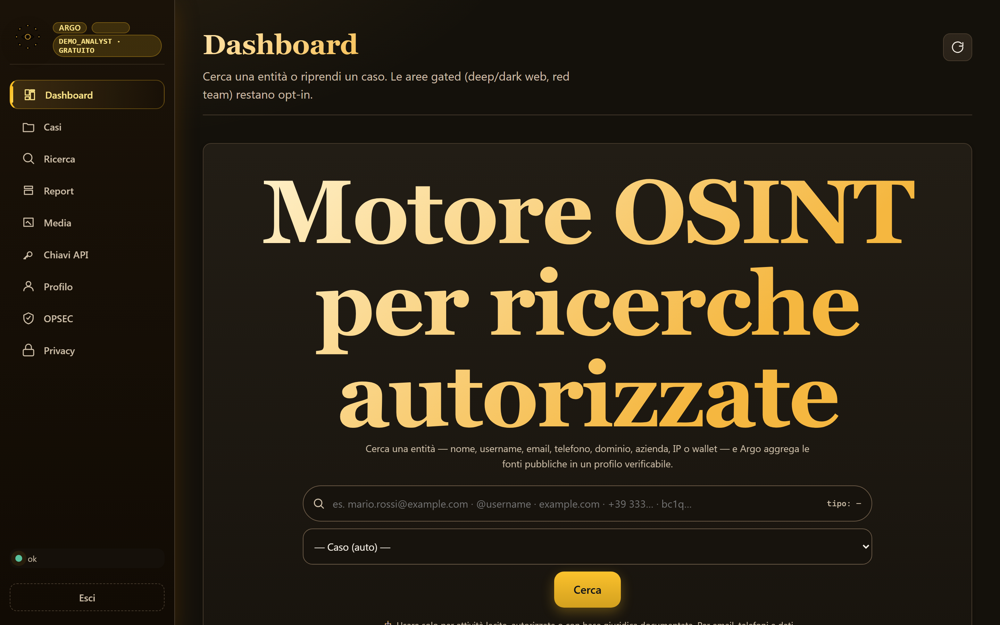
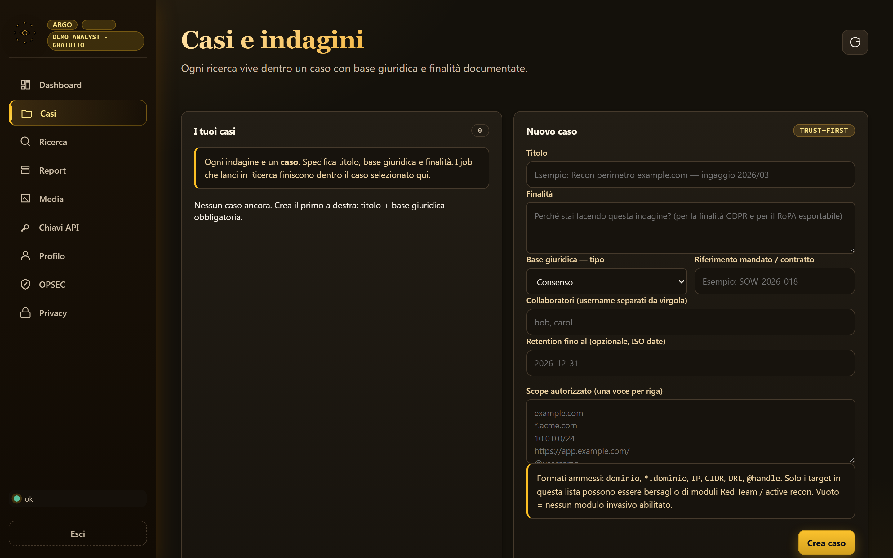
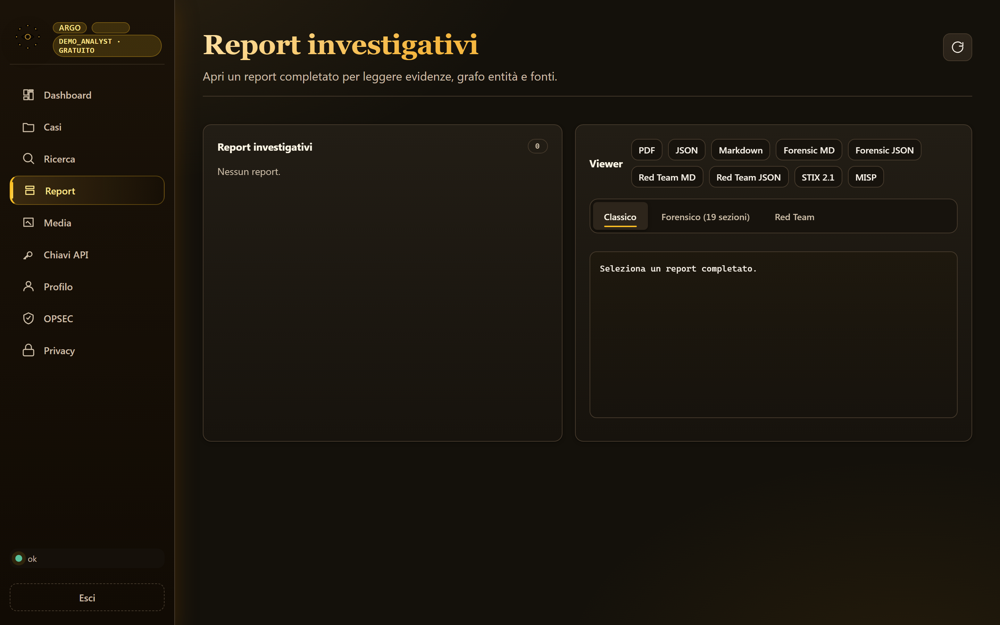
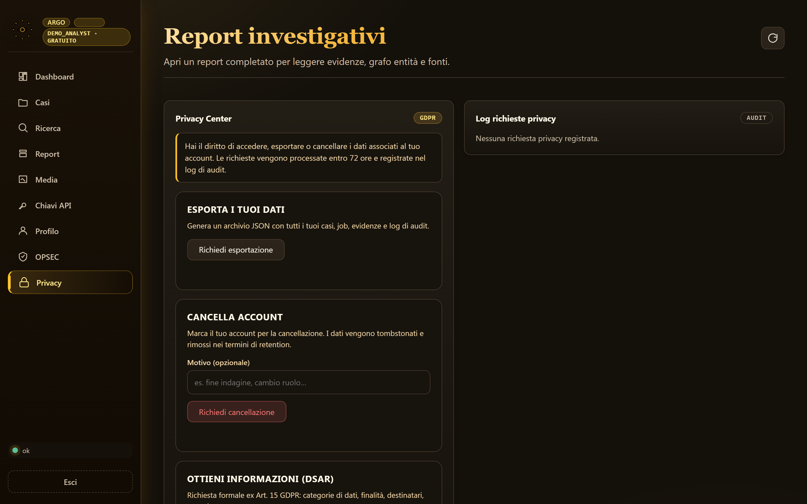
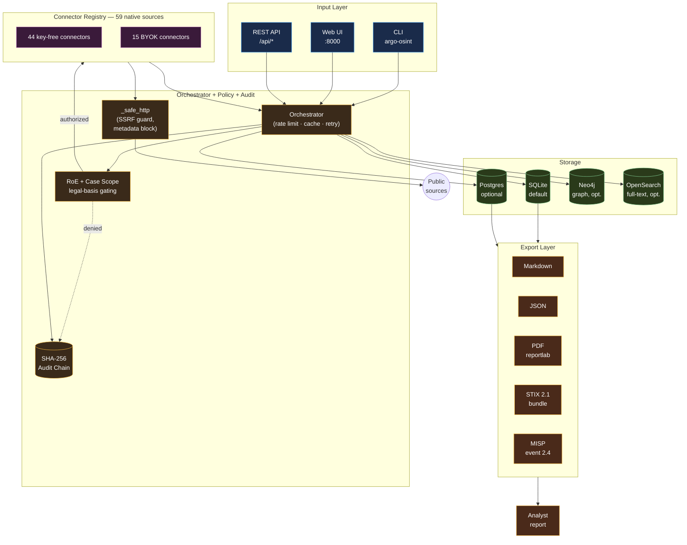

# Argo Cloud OSINT Platform

> A self-hosted defensive OSINT platform for analysts who need sourced, auditable and privacy-aware investigations.

[](https://github.com/gnudrus-del/argo-cloud-osint-platform/actions/workflows/ci.yml)
[](https://github.com/gnudrus-del/argo-cloud-osint-platform/releases)
[](LICENSE)
[](pyproject.toml)
[](https://github.com/gnudrus-del/argo-cloud-osint-platform/pkgs/container/argo-cloud-osint-platform)
[](https://github.com/gnudrus-del/argo-cloud-osint-platform/attestations)
[](docs/README.it.md)
[](https://argo-cloud.duckdns.org)

Argo runs entirely on your infrastructure. It aggregates public sources (59 native connectors, key-free and BYOK), keeps a SHA-256 audit chain of every finding, and produces reports in Markdown, JSON, PDF, STIX 2.1 and MISP formats. UI and connector output are bilingual (Italian / English). No telemetry, no cloud dependency, no vendor lock-in.

---

## Screenshots

<p align="center">
  
</p>

<p align="center">
  <em>Public landing at <code>/</code>. Above the fold: value proposition, hero, and a marquee of the platform's non-negotiables.</em>
</p>

<table>
  <tr>
    <td width="50%">
      
      <p align="center"><em>Dashboard — single-entity search bar, entity-type auto-detection, case-scoped queries.</em></p>
    </td>
    <td width="50%">
      
      <p align="center"><em>Cases — every case declares its legal basis, Rules of Engagement, collaborators and retention.</em></p>
    </td>
  </tr>
  <tr>
    <td width="50%">
      
      <p align="center"><em>Reports — nineteen-section forensic layout with source graduation and multi-format export.</em></p>
    </td>
    <td width="50%">
      
      <p align="center"><em>Privacy Center — GDPR data-subject rights and cryptographic tombstones for verified erasure.</em></p>
    </td>
  </tr>
</table>

### Sample report — inspect the output without installing

The [`docs/samples/example-report/`](docs/samples/example-report/) directory contains a real Argo report generated against `example.com` (RFC 2606 documentation domain):

- [`example.com.md`](docs/samples/example-report/example.com.md) — narrative report (Markdown, ~19 KB)
- [`example.com.json`](docs/samples/example-report/example.com.json) — structured findings (JSON, ~82 KB)
- [`example.com.pdf`](docs/samples/example-report/example.com.pdf) — court-ready PDF (~15 KB)

No API key was configured; the report uses only the 44 key-free connectors. See [`docs/samples/README.md`](docs/samples/README.md) for details.

---

## Why Argo?

Existing OSINT SaaS tools work well until you cannot send your case data to a third-party cloud — regulated investigations, corporate due diligence, journalist source-protection, legal cases with confidentiality obligations. Argo runs on **your** machine or VM. Your leads and findings never leave your perimeter.

## Features

- **CLI + web UI** — Python CLI for scripting; a lightweight web UI (no framework runtime bloat) for case management.
- **Bilingual UI and output (Italian / English)** — auto-detected on first visit, persisted per user, switchable at any time from a control in the top bar. Connector `notes`, `remediation` and `legal_note` are threaded through a shared message catalog and translated per request (`ConnectorContext.lang`).
- **Case-based investigations** — every query lives in a case with scope, Rules of Engagement, and DSAR (GDPR) endpoints.
- **Privacy-by-design target handling** — personal targets require an explicit legal basis; contacts are redacted by default.
- **BYOK provider model** — 15 optional providers (Shodan, VirusTotal, HIBP, SecurityTrails, etc.) use *your* API keys, never intermediated. Three additional providers (EmailRep, IPinfo, OpenCorporates) work without a key but return richer results if one is configured.
- **59 native connectors** — 44 key-free (crt.sh, RDAP, DNS, TLS certs, Wayback, Gravatar, GDELT, Nominatim, PhishTank, holehe, maigret, subdomain enumeration, and more) + 15 BYOK.
- **Sourced findings** — every finding carries evidence URLs, timestamps and confidence scoring.
- **Audit chain (SHA-256)** — every event (login, search, finding, deletion) is appended to a hash-chained log. Tampering with a past event invalidates every subsequent hash. Same pattern as Certificate Transparency and Git.
- **SSRF-hardened outbound HTTP** — every connector, plus the seed-URL fetcher used by the CLI and the job queue's `seed_urls` field, routes through a single `_safe_http` gateway that blocks cloud metadata (`169.254.169.254`), loopback, RFC1918, non-HTTP schemes and unfollowed cross-boundary redirects (including on the redirect chain of the fetcher's own `robots.txt` lookup). Enforced in CI for every connector: no connector may import `urllib.request`/`httpx`/`requests`/`aiohttp` directly.
- **Real DSAR (GDPR Art. 15 / Art. 17)** — the erasure endpoint runs an atomic transaction: redact audit events, append a `dsar_tombstoned` proof, delete business rows across all tables, all within one commit.
- **Markdown / JSON / PDF exports** — for analyst reports.
- **STIX 2.1 bundle + MISP event exports** — for TIP integration.
- **Connector/plugin architecture** — add a new source by implementing a small `BaseConnector` subclass.
- **Docker + self-hosted deployment** — includes `Dockerfile`, `docker-compose.yml`, systemd unit, and a Caddy reverse-proxy recipe. A prebuilt image is published to GHCR (`ghcr.io/gnudrus-del/argo-cloud-osint-platform:0.1.0`).

## Use cases

- **Defensive domain reconnaissance** — understand your own attack surface before an attacker does.
- **Corporate due diligence** — verify partners/vendors with sourced evidence.
- **Threat intelligence enrichment** — correlate observables (IPs, hashes, domains, wallets) with public feeds and your own MISP.
- **Authorized username / email / domain investigations** — with legal-basis gating and consent tracking.
- **Analyst reporting** — reproducible reports with audit chain for court-ready evidence.

## What Argo does *not* do

Argo is a **defensive** tool. It refuses to be a weapon.

- **No doxxing.** Personal-target investigations require explicit legal basis and produce redacted output by default.
- **No stalking.** Continuous monitoring of individuals is not offered.
- **No login bypass, credential stuffing, or account takeover assistance.**
- **No aggressive scraping.** All connectors respect rate limits and `robots.txt`.
- **No unauthorized scans.** Active recon (port scan, content discovery) requires an in-scope case and produces audit evidence.
- **No private-data purchase or "leak" resale enrichment.** BYOK integrations to HIBP/similar are for verification of *user-owned* accounts, not mass lookup.

---

## Quickstart (5 minutes)

### Install from source

```bash
git clone https://github.com/gnudrus-del/argo-cloud-osint-platform.git
cd argo-cloud-osint-platform
python -m venv .venv
# Linux/macOS: source .venv/bin/activate
# Windows PowerShell: .\.venv\Scripts\Activate.ps1
pip install -e .
argo-osint --help
```

### Pull the prebuilt Docker image

```bash
docker pull ghcr.io/gnudrus-del/argo-cloud-osint-platform:0.1.0
# also available as :latest
```

> **PyPI:** the project name `argo-cloud-osint` is reserved but not
> yet published; tracked in the roadmap below. Install from source or
> Docker in the meantime.

### Run the CLI

```bash
argo-osint example.com --type domain --provider none --max-pages 1 \
    --output-dir reports/smoke --format both
```

### Run the web UI

```bash
export OSINT_WEB_TOKEN="pick-a-long-random-token"
python -m osint_bot.web --host 127.0.0.1 --port 8000
# open http://127.0.0.1:8000
```

### Run with Docker

```bash
export OSINT_WEB_TOKEN="pick-a-long-random-token"
docker compose up --build
```

Full walkthrough: [`docs/QUICKSTART.md`](docs/QUICKSTART.md).

---

## Examples

Domain investigation, no API keys required:

```bash
argo-osint example.com --type domain --provider none \
    --output-dir reports/example --format both
```

Domain investigation with providers (BYOK):

```bash
export SHODAN_API_KEY=...
export VIRUSTOTAL_API_KEY=...
argo-osint example.com --type domain --provider all \
    --output-dir reports/example-full --format both
```

Company investigation:

```bash
argo-osint "Acme Corp" --type company --provider all \
    --output-dir reports/acme --format both
```

Authorized username investigation (requires case with legal basis):

```bash
argo-osint alice.example --type username --case-id CASE-2026-001 \
    --output-dir reports/case-001 --format both
```

More: [`docs/EXAMPLES.md`](docs/EXAMPLES.md).

---

## Architecture at a glance

Argo is a three-layer pipeline: **input** (CLI or web UI) → **orchestrator** (with policy, audit, storage) → **connectors** (59 native sources, key-free or BYOK) → **exports**. Every finding is sourced, timestamped, hash-linked into the audit chain, and gated by the case's Rules of Engagement.



### The 44 key-free connectors

Work out of the box, no signup, no API key. Grouped by capability. Three of these (`emailrep`, `ipinfo`, `opencorporates`) accept a BYOK for richer output but do not require one — they are also listed under **The 15 BYOK connectors** below.

**Domain & DNS intelligence (7)**

| Connector | What it does |
| --- | --- |
| `crt_sh` | Certificate Transparency log lookup — subdomains via TLS certs |
| `rdap` | RFC 7482 registry query — domain/IP registration data |
| `dns_query` | A / AAAA / MX / NS / TXT / CNAME / SRV / CAA |
| `tls_cert` | Live TLS handshake, cert chain, SAN, issuer, validity |
| `wayback` | Wayback Machine CDX — historical URL archive |
| `subdomain_enum` | Native subdomain enumeration (crt.sh + bruteforce + DNS) |
| `dnstwist_native` | Typosquat / phishing domain generator + resolver |

**Web fingerprint & content (5)**

| Connector | What it does |
| --- | --- |
| `web_fingerprint` | HTTP headers, techs, favicon hash, server banner |
| `common_crawl` | Common Crawl index lookup (URLs by domain) |
| `content_discovery` | Native gobuster-lite (in-scope only) |
| `url_harvest` | Extract external links, contacts, secrets from a page |
| `secret_scan` | Public-repo secret scanning (regex + entropy) |

**Threat intelligence — no-key (4)**

| Connector | What it does |
| --- | --- |
| `phishtank` | PhishTank feed for known phishing URLs |
| `openphish` | OpenPhish feed for phishing URLs |
| `threatfox` | abuse.ch ThreatFox IoC feed |
| `shodan_internetdb` | Shodan InternetDB (free tier IP intelligence) |

**Geo & OSINT open data (3)**

| Connector | What it does |
| --- | --- |
| `nominatim` | OpenStreetMap geocoding (Nominatim) |
| `overpass` | OpenStreetMap Overpass API (POI, features) |
| `gdelt` | GDELT global event & tone feed |

**Email OSINT — no-key (4)**

| Connector | What it does |
| --- | --- |
| `holehe` | Site enumeration: on which sites the email is registered |
| `holehe_native` | Native re-implementation of holehe (subset, no deps) |
| `gravatar` | Gravatar profile / avatar lookup |
| `ignorant` | Phone number → account existence on major services |

**Username OSINT — no-key (2)**

| Connector | What it does |
| --- | --- |
| `sherlock_lite` | Fast subset of Sherlock (top ~100 sites) |
| `maigret` | Full Maigret (~3000 sites), HTML report, PDF option |

**Domain-wide harvesting (1)**

| Connector | What it does |
| --- | --- |
| `theharvester` | theHarvester: emails + hostnames from a domain |

**Corporate registry — no-key (1)**

| Connector | What it does |
| --- | --- |
| `sec_edgar` | SEC EDGAR filings for US public companies |

**Network intelligence — no-key (2)**

| Connector | What it does |
| --- | --- |
| `asn_lookup` | ASN → prefixes, org, allocation |
| `port_scan` | In-scope, audited native TCP port scan |

**Phone OSINT (2)**

| Connector | What it does |
| --- | --- |
| `phone_meta` | Carrier, region, line type (phonenumbers lib) |
| `phone_footprint` | Reverse lookup: number → account exposure hints |

**Social reverse (5)**

| Connector | What it does |
| --- | --- |
| `ghunt` | Google account → Gmail / activity metadata (BYOK cookies) |
| `toutatis` | Instagram username → obfuscated email/phone (BYOK sessionid) |
| `socid_extractor` | Extract social IDs & metadata from a profile URL |
| `linkedin2username` | LinkedIn company → employee usernames (BYOK credentials) |
| `telegram_checker` | Telegram phone → account existence (BYOK API id/hash) |

**Darkweb (1)**

| Connector | What it does |
| --- | --- |
| `darkweb_scan` | Ahmia index scan for .onion mentions (no crawl) |

**Aggregators (2)**

| Connector | What it does |
| --- | --- |
| `legit_scorer` | Native SION-like aggregator: combines other connectors into a single trust score |
| `flowsint` | Optional bridge to a running FlowSINT stack (disabled by default) |

**Bridges (1)**

| Connector | What it does |
| --- | --- |
| `misp_client` | Bidirectional bridge to your own MISP instance |

**Blockchain (light) — no-key** — see BYOK for full-featured providers.

### The 15 BYOK connectors

Fill only what you have; missing keys are silently skipped (`missing_key` status).

| Connector | Provider | Env var | Purpose |
| --- | --- | --- | --- |
| `shodan` | Shodan | `SHODAN_API_KEY` | Passive host/service intelligence |
| `virustotal` | VirusTotal | `VIRUSTOTAL_API_KEY` | File/URL/domain/IP reputation |
| `hibp` | Have I Been Pwned | `HIBP_API_KEY` | Breach exposure lookup |
| `hunter` | Hunter.io | `HUNTER_API_KEY` | Email finder / verifier |
| `securitytrails` | SecurityTrails | `SECURITYTRAILS_API_KEY` | Historical DNS |
| `greynoise` | GreyNoise | `GREYNOISE_API_KEY` | Internet background noise labels |
| `otx` | AlienVault OTX | `OTX_API_KEY` | Threat pulses |
| `emailrep` | EmailRep.io | `EMAILREP_API_KEY` | Email reputation |
| `ipinfo` | IPinfo | `IPINFO_API_KEY` | IP geolocation + ASN |
| `etherscan` | Etherscan | `ETHERSCAN_API_KEY` | Ethereum blockchain queries |
| `opencorporates` | OpenCorporates | `OPENCORPORATES_API_KEY` | Global company registry |
| `companies_house` | Companies House | `COMPANIES_HOUSE_API_KEY` | UK company registry |
| `brave_search_api` | Brave Search | `BRAVE_SEARCH_API_KEY` | Web search API |
| `google_pse` | Google PSE | `GOOGLE_PSE_API_KEY` | Programmable search engine |
| `influencers_club` | Influencers Club | `INFLUENCERS_CLUB_API_KEY` | Username → verified email |
| `abuseipdb` | AbuseIPDB | `ABUSEIPDB_API_KEY` | Reported abusive IPs |
| `github_search` | GitHub Search | `GITHUB_TOKEN` | Code / secret search across GitHub |
| `leakix` | LeakIX | `LEAKIX_API_KEY` | Leak & exposure intelligence |

> The table lists 18 rows: **15** connectors declare a required API key (Argo reports `missing_key` cleanly when unset) and **3** more (`emailrep`, `ipinfo`, `opencorporates`) accept an optional key for richer results but function without one. Tenant-owned bridges (`misp_client`, `flowsint`) are counted separately in the key-free list and expect credentials to *your own* instance rather than a third-party API key from Argo's side.

### Data flow — one investigation, end to end

1. **Case creation** — analyst opens a case in the web UI or via `--case-id` on the CLI. Rules of Engagement + legal basis are recorded. `case_created` event → audit chain.
2. **Query dispatch** — orchestrator matches the target type (`domain`, `ip`, `email`, `handle`, `phone`, `wallet`, `company`) against every connector's `input_types` and `action_class`, filters by RoE.
3. **Rate & policy** — each connector enforces its own per-minute / per-day / burst cap; `_safe_http` blocks SSRF, cloud metadata (`169.254.169.254`), and RFC1918 targets.
4. **Fetch → Findings** — every connector returns `Finding` objects with evidence URLs, confidence, source reliability, and `why_linked` rationale. `finding_added` event → audit chain.
5. **Storage** — findings land in SQLite / Postgres; graph shape optionally synced to Neo4j; text index optionally to OpenSearch.
6. **Export** — Markdown / JSON / PDF for humans; STIX 2.1 bundle + MISP event for TIP integration. `report_generated` event → audit chain.
7. **DSAR (optional)** — subject rights: `privacy_requests` + `dsar_tombstones` tables record deletion/export with cryptographic proof-of-erasure.

Details: [`docs/ARCHITECTURE.md`](docs/ARCHITECTURE.md) · [`docs/CONNECTORS.md`](docs/CONNECTORS.md) · [`docs/THREAT_MODEL.md`](docs/THREAT_MODEL.md).

---

## Plugin / connector architecture

A connector implements one small interface (`BaseConnector`) that takes a target and returns `Finding` objects with evidence URLs and confidence. A connector declares:

- **Input types** it accepts (domain, ip, email, handle, phone, wallet, …).
- **Action class** — `passive` (public data only), `active` (touches target), or `intrusive` (gated).
- **Rate limit** — per-minute, per-day and burst.
- **Legal note** — human-readable summary of what data it exposes and when it should not be used.
- **Optional key** — `required_key` names an env var; if unset, the connector reports `missing_key` cleanly.

Add a new source in ~50 lines. See [`docs/CONNECTORS.md`](docs/CONNECTORS.md).

---

## Security and responsible use

Argo is built for authorized investigations. Reading data about a person you have no legal basis to investigate is **your** legal problem, not Argo's — but Argo tries to make the right thing the easy thing.

- **Security model:** [`docs/THREAT_MODEL.md`](docs/THREAT_MODEL.md)
- **Responsible use guide:** [`docs/RESPONSIBLE_USE.md`](docs/RESPONSIBLE_USE.md)
- **Vulnerability disclosure:** [`SECURITY.md`](SECURITY.md)

### Security model (short version)

- Runs entirely local / self-hosted. Assumed threat model: single-tenant analyst on a trusted machine or VM.
- **BYOK.** Argo does not intermediate third-party APIs. Your keys, your rate quota, your invoice.
- **No hardcoded secrets.** All configuration via env vars; `.env.example` is documented; `.gitignore` blocks `.env`, `*.env`, `secrets.env`, `deploy_artifacts/`.
- **Target data at rest** is stored under case scope in SQLite (default) or Postgres. Encryption-at-rest is currently **not** applied — treat the datastore as sensitive and use OS-level disk encryption. Tracked as a roadmap item.
- **Audit chain (SHA-256)** for tamper-evidence. Full-chain verification is a single CLI command.
- **DSAR (GDPR):** deletion and export endpoints are implemented.

---

## Roadmap

See [`docs/ROADMAP.md`](docs/ROADMAP.md). Highlights of the near-term plan.

**Recently shipped**

- Bilingual UI and connector output (Italian / English) with per-request `ConnectorContext.lang` — v0.2.
- Centralised policy gate (Rules of Engagement + case-scope enforcement) in `BaseConnector.run` — hardening H1.
- SSRF-hardened outbound HTTP: every connector routes through `_safe_http`, redirect-revalidated, cloud-metadata-blocked, CI-enforced — hardening H2.
- SSRF hardening extended to the CLI/job-queue seed-URL fetcher (`osint_bot/fetch.py`, reachable from the web job queue's `seed_urls` field), including its `robots.txt` lookup — hardening H2 follow-up.
- Real DSAR (GDPR Art. 17): atomic erasure transaction with hash-chained `dsar_tombstoned` proof — hardening H3.
- Prebuilt Docker image published to GHCR (`:0.1.0`, `:latest`) with Sigstore build provenance.

**Planned**

- Connector-key encryption at rest.
- First PyPI release under name `argo-cloud-osint` (the name is reserved; upload workflow is scaffolded via a Trusted Publisher).
- AI enrichment (`ai` extra) — OCR + NER + language detection (experimental).

**Frozen / experimental**

- `web-next/` — Next.js prototype for graph visualization. Superseded by the production Python-served UI; kept as reference. See [`web-next/STATUS.md`](web-next/STATUS.md).

---

## Contributing

Contributions welcome. Please read [`CONTRIBUTING.md`](CONTRIBUTING.md) and [`CODE_OF_CONDUCT.md`](CODE_OF_CONDUCT.md) before opening a PR.

For questions or ideas, open a [discussion](https://github.com/gnudrus-del/argo-cloud-osint-platform/discussions).

---

## Star the project

If Argo helps your OSINT workflow, consider starring the repository so other analysts can find it. It is the single most useful thing you can do to support the project without writing code.

---

## License

Apache License 2.0 — see [`LICENSE`](LICENSE).

---

## Documentazione in italiano

Vedi [`docs/README.it.md`](docs/README.it.md) per la versione italiana.
